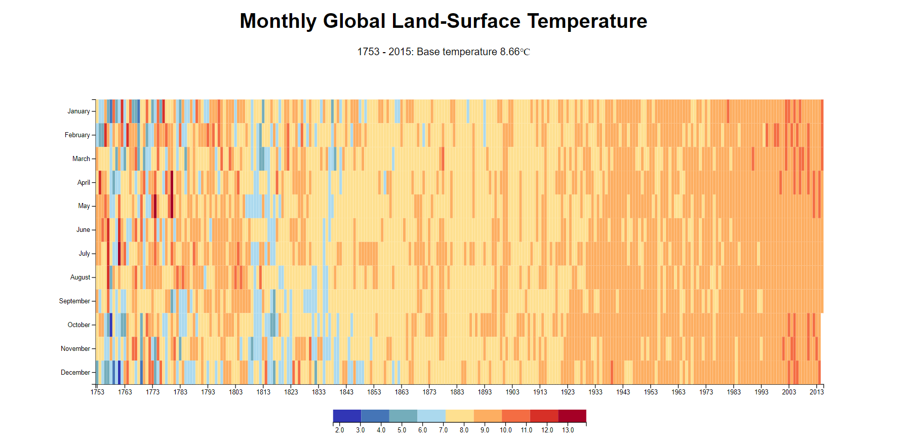

# Visualize-data-with-a-heat-map

## Project Description

This project visualizes Monthly Global Land-Surface Temperature as a heat map using D3.js. The data is fetched from a JSON file provided by freeCodeCamp and displayed interactively on a webpage. Users can hover over the heat map to see detailed information about Month, Year and corresponding Temperature.

## Project Setup

To set up the project locally, follow these steps:

1. Clone the repository to your local machine using:
   ```bash
   git clone https://github.com/your-username/visualize-data-with-a-heat-map

[the live site](https://moezltifi.github.io/visualize-data-with-a-heat-map/)



